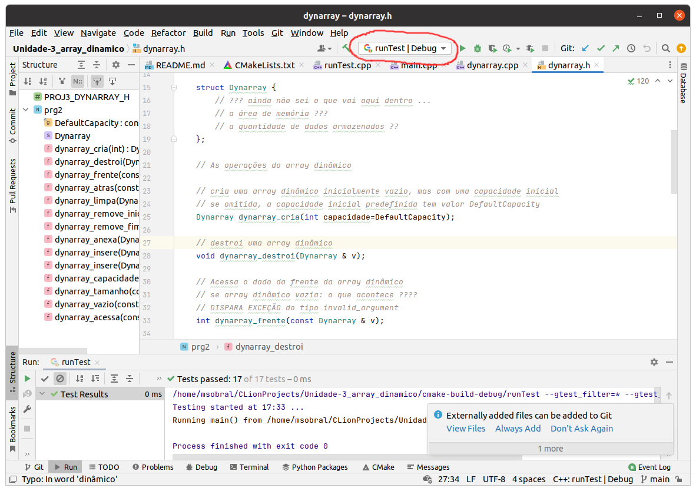
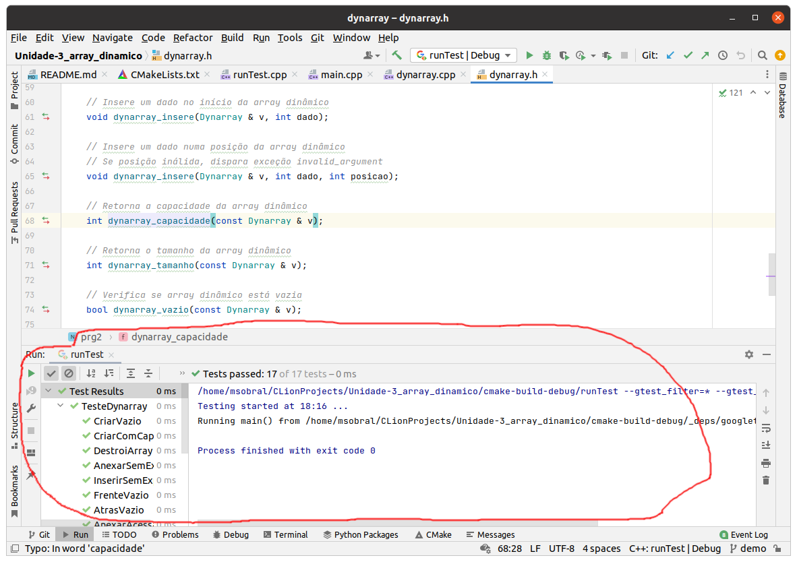

# Unidade-3_array_dinamico

* [mais informações sobre o array dinâmico](https://moodle.ifsc.edu.br/mod/book/view.php?id=650470&chapterid=110230)

Aqui você encontra o código inicial para a implementação do array dinâmico. Esse código define a [API ](https://pt.wikipedia.org/wiki/Interface_de_programa%C3%A7%C3%A3o_de_aplica%C3%A7%C3%B5es) do array dinãmico, na forma de um conjunto de funções declaradas em [dynarray.h](/dynarray.h). Para implementar o seu array dinâmico, você deve:
* Completar a declaração do tipo de dados [Dynarray](https://github.com/IFSC-Engtelecom-Prg2/Unidade-3_array_dinamico/blob/b1de7b1991ea3a4570d4cc3a89e4946139823564/dynarray.h#L15), o qual representa arrays dinâmicos neste estudo de caso
* Implementar as funções que correspondem ás operações do array dinâmico (implemente-as em [dynarray.cpp](/dynarray.cpp))

## Teste do array dinâmico

A sua implementação do array dinãmico pode ser testada. Junto com o projeto CLion, existem testes das operações do array, então você pode realizar esses testes à medida que desenvolve as funções. Se os testes derem certo, então muito provavelmente seu array dinâmico está correto !

Para rodar os testes, selecione a configuração _runTest_, como indicado na figura a seguir:

Para executar os testes, clique no botão _Run_, e observe os resultados no painel inferior do CLion:

